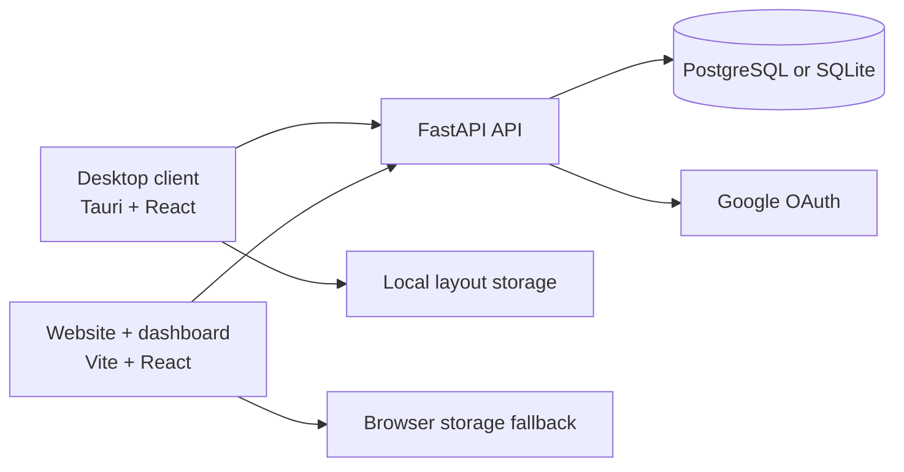

# Widget Studio

[](https://github.com/susin-d/Widget-Studio/releases)
[](https://github.com/susin-d/Widget-Studio)
[](https://github.com/susin-d/Widget-Studio/issues)

Widget Studio is a Windows 11 desktop widget workspace with a browser-based dashboard and optional cloud synchronization. Build a personal desktop from draggable, resizable widgets, then manage layouts and settings from the web client.

The project combines a native Windows application, a Vite web application, and a FastAPI synchronization API in one repository.

## Highlights

- Native Windows desktop widgets powered by Tauri v2, Rust, React, and TypeScript
- Draggable, resizable, grid-snapped layouts with locking, pinning, and coordinate memory
- Windows 11-inspired acrylic and glassmorphism themes
- Built-in Clock, World Clock, Weather, Notes, Sticky Notepad, Todo, System Monitor, Pomodoro, Calculator, Calendar, Quick Links, Mindmap, and Custom Widget experiences
- Browser dashboard with local-storage fallbacks for development and offline use
- Email/password authentication, Google OAuth, JWT sessions, and layout synchronization
- Optional AI chatbot support through an OpenAI-compatible backend
- Windows MSI and NSIS packaging with signed updater artifacts through GitHub Releases

## Repository layout

```text
.
├── desktop/       # Native Windows client: Tauri v2 + React + TypeScript
├── website/       # Marketing site and browser dashboard: Vite + React
├── server/        # Sync and authentication API: FastAPI + SQLAlchemy
├── docs/          # Developer and custom-widget documentation
├── scripts/       # Windows build and release helper scripts
└── assets/        # Shared visual assets
```

## Architecture



The desktop and website clients share the same product concepts but keep platform-specific behavior at the edges. Native operations such as system metrics, startup integration, tray actions, deep links, and updater checks are implemented by the desktop client and Rust host. The API is the source of truth for authenticated layout synchronization.

## Requirements

For the full project:

- Windows 10/11
- Node.js 20 or newer
- Rust stable and Cargo
- Microsoft C++ Build Tools and WebView2 Runtime for Tauri development
- Python 3.9 or newer
- PostgreSQL for shared or production data (SQLite can be used for local development)

You can work on the website, desktop client, or API independently without installing every toolchain.

## Quick start

Clone the repository and install the client dependencies:

```powershell
git clone https://github.com/susin-d/Widget-Studio.git
cd Widget-Studio

cd desktop
npm install
cd ..\website
npm install
```

### Start the API

Create a Python environment and install the server dependencies:

```powershell
cd server
python -m venv venv
.\venv\Scripts\Activate.ps1
pip install -r requirements.txt
Copy-Item .env.example .env
```

For a local SQLite database, set these values in `server/.env`:

```env
DATABASE_URL=sqlite+aiosqlite:///./widgets.db
AUTO_CREATE_SCHEMA=true
SECRET_KEY=change-this-for-local-development
```

For PostgreSQL, use a `postgresql+asyncpg://...` connection string instead. The server normalizes the configured driver for its synchronous SQLAlchemy session.

Bootstrap the schema and run the API:

```powershell
python -m init_db
python -m uvicorn main:app --reload --port 8000
```

The API is available at [localhost:8000](http://localhost:8000), with interactive documentation at [localhost:8000/docs](http://localhost:8000/docs).

### Start the website

In a second terminal:

```powershell
cd website
Copy-Item .env.example .env
npm install
npm run dev
```

The website runs at [localhost:5173](http://localhost:5173). Set `VITE_BACKEND_URL` in `website/.env` if the API is running somewhere other than `http://localhost:8000`.

### Start the desktop client

In a third terminal:

```powershell
cd desktop
npm install
npm run tauri:dev
```

To preview only the browser UI, run `npm run dev` from `desktop/` instead.

## Useful commands

| Area | Command | Purpose |
| --- | --- | --- |
| Desktop | `npm run tauri:dev` | Run the native Windows app |
| Desktop | `npm run build` | Type-check and build the desktop frontend |
| Desktop | `npm run lint` | Run the TypeScript check |
| Desktop | `npm run tauri:build` | Build MSI and NSIS installers |
| Website | `npm run dev` | Start the web development server |
| Website | `npm run build` | Type-check and build the website |
| Website | `npm run lint` | Run the TypeScript check |
| Server | `python -m uvicorn main:app --reload --port 8000` | Start the API |
| Server | `python -m init_db` | Create the configured database schema |

Run client commands from the corresponding `desktop/` or `website/` directory.

## Configuration

The example environment files document the supported settings:

- [`server/.env.example`](server/.env.example) — database, JWT, OAuth, and AI provider settings
- [`website/.env.example`](website/.env.example) — API base URL used at build time
- [`desktop/.env.example`](desktop/.env.example) — desktop client environment settings

Never commit `.env` files, database credentials, OAuth secrets, API keys, or Tauri signing keys. Keep `AUTO_CREATE_SCHEMA=true` limited to local one-off development; production deployments should apply schema changes explicitly.

## Custom widgets

The Custom Widget editor supports embedded HTML, CSS, JavaScript, iframes, and the `WidgetStudio.request(...)` bridge. See the [custom widget guide](docs/custom-widget-guide.md) for the supported blocks, permissions, API usage, and troubleshooting notes.

## Releases

The GitHub Actions release workflow runs when a version tag matching the Tauri version is pushed:

```powershell
git tag v0.1.0
git push origin v0.1.0
```

Signed updater releases require the following GitHub Actions secrets:

```text
TAURI_SIGNING_PRIVATE_KEY
TAURI_SIGNING_PRIVATE_KEY_PASSWORD
```

The private key must remain outside the repository and paired with the updater public key in `desktop/src-tauri/tauri.conf.json`. To build a signed release locally, configure the same variables in the PowerShell session and run `npm run tauri:build:release` from `desktop/`.

To refresh the installer asset and metadata consumed by the website after a local MSI build:

```powershell
.\scripts\build-msi-and-update-site.ps1
```

## Contributing

Contributions are welcome. Before opening a pull request:

1. Create a focused branch from the current default branch.
2. Keep changes scoped and update documentation when behavior or configuration changes.
3. Run the relevant TypeScript checks and production builds for the areas you touched.
4. Include reproduction steps, screenshots, or logs when changing user-visible behavior.
5. Open an issue first for large feature proposals so the design can be discussed.

Please do not include secrets, generated installers, local databases, or machine-specific files in commits. Use the [issue tracker](https://github.com/susin-d/Widget-Studio/issues) for bug reports and feature requests.

## License

No license file is currently included in this repository. Until a license is added, the source should not be assumed to be available for redistribution or commercial reuse.

## Acknowledgements

Widget Studio is built with [Tauri](https://tauri.app/), [React](https://react.dev/), [Vite](https://vite.dev/), [FastAPI](https://fastapi.tiangolo.com/), [SQLAlchemy](https://www.sqlalchemy.org/), [Zustand](https://zustand.docs.pmnd.rs/), and [Tailwind CSS](https://tailwindcss.com/).
