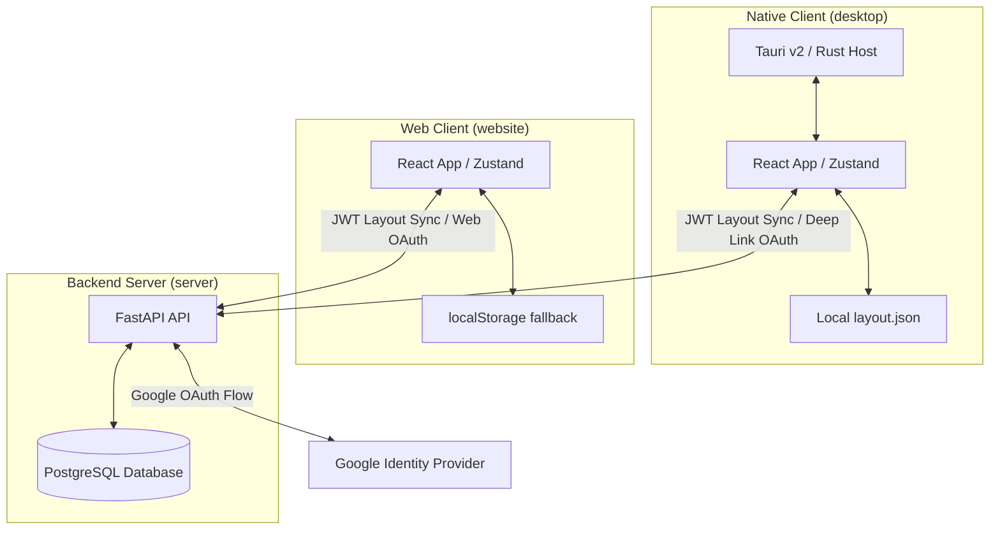

# Widget Studio

Widget Studio is a premium, modular, and highly customizable desktop widget host for Windows 11, paired with a cloud-synchronized web dashboard. Built using **Tauri v2, React, TypeScript, Zustand, and Tailwind CSS**, it is backed by a **FastAPI + PostgreSQL** sync server supporting secure email/password registration and Google OAuth.

The application allows users to create transparent, interactive, and beautifully animated desktop widgets (clocks, weather, system monitors, notes, mindmaps, and more) that sit directly on the desktop surface, persist their states, snap to grids, and synchronize dynamically to the cloud.

---

## 📂 Repository Structure

This is a monorepo consisting of three main modules:

```text
widget/
├── desktop/       # Native Windows 11 desktop application host (Tauri v2 + React)
├── website/       # Marketing landing page & cloud-based dashboard (Vite + React)
├── server/        # Synchronizing API backend (FastAPI + PostgreSQL)
└── assets/        # Static visual assets and icons
```

---

## 🏗️ Architecture Overview



### Module Responsibilities

1. **`desktop/`**: Operates as a native Windows application. It runs frameless, transparent Tauri windows (`widget-<uuid>`) that skip the taskbar, sit always-on-top or pinned on the desktop, and auto-restore themselves when the desktop is revealed (e.g. using the Windows three-finger swipe).
2. **`website/`**: Served as a browser app. It hosts the public marketing presence, product FAQ, download links, and an in-browser dashboard preview. When logged in, it acts as a layout editor and retrieves configurations from the backend.
3. **`server/`**: A REST API built with FastAPI. It handles password-based authentication, Google OAuth authorization flow, and stores/syncs the widget layouts in a PostgreSQL database.

---

## 🎨 Design System & Visuals

Widget Studio features a Windows 11-inspired glassmorphism look:
- **Acrylic Surfaces**: Dynamic backdrop blur, soft reflections, border highlights, and variable shadow levels.
- **Accent Themes**: Six premium built-in color palettes (Berry Pop, Citrus Splash, Ocean Candy, Lavender Dream, Mint Sorbet, Midnight Neon) with light and dark mode flexibility.
- **Micro-Animations**: Fluid transitions powered by Framer Motion.
- **Responsive Layout**: Sidebars, widgets, control bar, and inspector adapt smoothly across canvas resolutions.

---

## ⚙️ Core Application Features

- **Draggable & Resizable Canvas**: Drag, drop, and manually resize widgets with the mouse. Clean grid-snapping (12px intervals) allows tidy alignment.
- **Window Locking & Pinning**: Pin a widget to place it as an independent native window on the desktop. Lock positions to prevent accidental shifts.
- **Coord Memory**: Unpinning/pinning restores the widget back to its previous position on the canvas canvas seamlessly.
- **Zero Terminal Popups**: Native CLI hooks and process creation are structured cleanly to avoid terminal flickers or popping windows during background runs.

---

## 🧩 Widget Catalog

Widget Studio comes with **13 built-in widgets**:

| Widget Name | Description | Key Features |
|---|---|---|
| 🕒 **Clock** | Analog/digital hybrid clock | Custom time formats, seconds toggling, dynamic sizes |
| 🌐 **World Clock** | Time tracker for different time zones | Multiple timezone cards, clean visual indicator |
| 🌤️ **Weather** | Offline-safe local weather monitor | Temp, weather condition icons, fallback graphics |
| 📝 **Notes** | Simple scratchpad note-taker | Auto-saving text area with customized font sizing |
| 📌 **Sticky Notepad** | Virtual Windows-style sticky notes | Per-note styling, background coloring, list tags |
| ✅ **Todo** | Interactive checklist builder | Add, check, filter, delete, and progress indicator |
| 📈 **System Monitor** | Native memory and CPU metrics | Visual line charts for CPU/RAM usage (Tauri native) |
| 🍅 **Pomodoro** | Time management focus timer | Custom intervals, alerts, visual progress circle |
| 🧮 **Calculator** | Full-featured workspace calculator | Keypad inputs, history tape, standard operators |
| 📅 **Calendar** | Monthly date viewer and planner | Full month grid, interactive day highlights, current day indicator |
| 🔗 **Quick Links** | Grid of bookmark icons | Custom web URL targets, icons, label naming |
| 🧠 **Mindmap** | Node-based interactive brainstorming tree | Add/delete branches, auto-layouts, custom connections |
| 🌐 **Custom Widget** | iframe / HTML embed workspace | Embed videos, maps, custom websites, or custom CSS code |

---

## 🚀 Setup & Execution Guide

### Creating a custom widget

Open **Dev tools** in Widget Studio for the visual/code builder, live sandbox preview, permissions guide, and publishing flow. See the full [custom widget guide](docs/custom-widget-guide.md) for block behavior, the `WidgetStudio.request(...)` API, and troubleshooting.

Ensure you have **Node.js 20+**, **Rust stable**, **Python 3.9+**, and **PostgreSQL** installed.

### 1. Launching the Backend Server

Navigate to the `server/` directory, set up your Python virtual environment, install requirements, and set up your config:

```powershell
# Set up environment
cd server
python -m venv venv
.\venv\Scripts\Activate.ps1
pip install -r requirements.txt

# Create .env config
copy .env.example .env  # Or create one manually with DATABASE_URL, SECRET_KEY, and Google OAuth credentials

# Start FastAPI
python -m uvicorn main:app --reload --port 8000
```
*API docs will be available at [http://localhost:8000/docs](http://localhost:8000/docs).*

### 2. Launching the Website

Navigate to the `website/` directory, install dependencies, and spin up the web development server:

```powershell
cd website
npm install
npm run dev
```
*Website runs at [http://localhost:5173](http://localhost:5173).*

### 3. Launching the Desktop Client

Navigate to the `desktop/` directory, install dependencies, and run in Tauri developer mode:

```powershell
cd desktop
npm install
npm run tauri:dev
```

---

## ☁️ Deploying Website and API as Separate Vercel Projects

Create two Vercel projects from this same repository:

### 1. API project

- **Root Directory:** `server`
- **Framework Preset:** Other
- **Build Command:** leave empty
- **Output Directory:** leave empty
- `server/api/index.py` exposes the FastAPI app as a Vercel Python Function.
- `/api/*` keeps the same API paths used by local development and the desktop client.

Add these environment variables to the API project:

```env
DATABASE_URL=postgresql://<user>:<password>@<host>/<database>
SECRET_KEY=<long-random-production-secret>
AUTO_CREATE_SCHEMA=false
GOOGLE_CLIENT_ID=<google-client-id>
GOOGLE_CLIENT_SECRET=<google-client-secret>
GOOGLE_REDIRECT_URI=https://<api-domain>/api/auth/google/callback
WEB_AUTH_REDIRECT_URI=https://<website-domain>/auth/callback
OPENAI_API_KEY=<optional>
```

### 2. Website project

- **Root Directory:** `website`
- **Framework Preset:** Vite
- The committed `website/vercel.json` builds with `npm run build` and publishes `dist`.

Add this environment variable to the Website project before deploying:

```env
VITE_BACKEND_URL=https://<api-domain>
```

Because Vite embeds `VITE_BACKEND_URL` at build time, redeploy the website after changing it.

Use a managed PostgreSQL database for `DATABASE_URL`; Vercel function instances and their local filesystem are ephemeral. Apply the existing schema once before enabling signup or layout sync:

```powershell
$env:DATABASE_URL="postgresql://<user>:<password>@<host>/<database>"
python -m server.init_db
```

The API health check is available at `https://<api-domain>/` (also `/health` and `/api/health`). Add the API callback URL to Google Cloud OAuth, and use the website callback URL as the web redirect target.

---

## 🔒 Authentication & Synchronization Workflow

When a user initiates Google Sign-In:
1. **Desktop / Website** triggers OAuth request to the FastAPI Server: `/api/auth/google`.
2. **Server** redirects user to the Google Login consent page.
3. User completes login; Google redirects back to server callback `/api/auth/google/callback` with authorization code.
4. **Server** exchanges code for a profile, stores user in db, generates a JWT session token, and redirects desktop OAuth to `widgetapp://auth/callback` or web OAuth to the website callback.
5. **Desktop application** registers the custom protocol (`widgetapp://`) and absorbs the JWT to hydrate state and begin synchronization.
# Widget-Studio
# Widget-Studio
