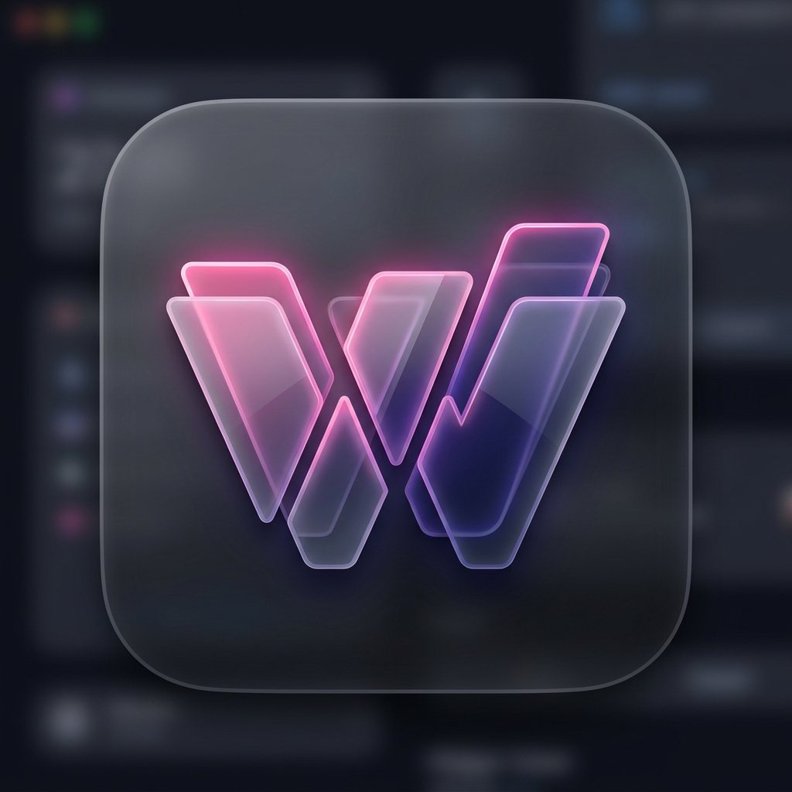
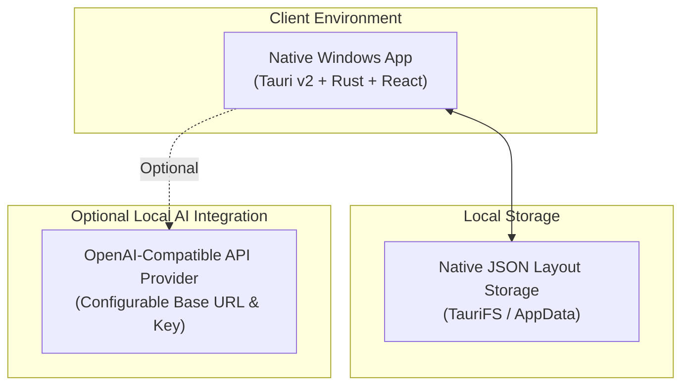

<p align="center">
  
</p>

# Widget Studio

[](https://github.com/susin-d/Widget-Studio/releases)
[](https://opensource.org/licenses/MIT)
[](https://github.com/susin-d/Widget-Studio/issues)

**Widget Studio** is a privacy-first, 100% local Windows 11 desktop widget workspace. Build your personal desktop layout using draggable, resizable widgets with grid snapping, custom theme controls, and local state persistence.

---

## ✨ Features

- 💻 **100% Local-First**: Offline-ready with no mandatory external services.
- 🪟 **Native Windows 11 Desktop Overlays**: Powered by **Tauri v2**, Rust, React, and TypeScript.
- 🎨 **Rich Glassmorphism & Custom Themes**: Windows 11-inspired acrylic glass background options, customizable blur, corner radius, and accent colors.
- 🧩 **Built-in Widgets**:
  - Clock & World Clock
  - Weather (Local ambient / offline safe)
  - Notes & Sticky Notepad
  - Todo Checklist & Task Tracker
  - System Monitor (CPU & RAM metrics)
  - Pomodoro Focus Timer
  - Calculator & Calendar
  - Quick Links & Mindmap
  - Custom Widget Runtime
- 🛠️ **Custom Widget Studio**: Visual builder & code editor (HTML, CSS, JS) with sandboxed permissions (`network`, `clipboard`, `notifications`, `openExternal`).
- 🤖 **Local AI Chatbot**: Built-in AI companion with persona selection and customizable OpenAI-compatible API configurations.

---

## 📂 Repository Structure

```text
.
├── desktop/       # Native Windows client: Tauri v2 + React + TypeScript + Vite
├── docs/          # Product and custom-widget developer documentation
├── scripts/       # Windows build and installer packaging scripts
├── assets/        # Visual assets and screenshots
├── LICENSE        # MIT Open Source License
└── CONTRIBUTING.md# Open source contribution guide
```

---

## 🏗️ System Architecture



---

## 🚀 Quick Start

### Prerequisites
- **Node.js**: v20 or newer
- **Rust & Cargo**: Stable toolchain (for Windows Tauri native app)
- **Windows 10/11**: For native desktop widget overlays

### Installation & Launch

1. **Clone the repository**:
   ```bash
   git clone https://github.com/susin-d/Widget-Studio.git
   cd Widget-Studio
   ```

2. **Setup and Run Desktop App**:
   ```bash
   cd desktop
   npm install
   npm run tauri:dev
   ```

---

## 🛠️ Commands Reference

| Command | Purpose |
| --- | --- |
| `npm run tauri:dev` | Launch native Windows application in dev mode |
| `npm run build` | Type-check and build frontend web dist |
| `npm run tauri:build` | Compile native Windows installers (NSIS / MSI) |

---

## 🧩 Custom Widgets

You can create, edit, and run custom sandboxed HTML/CSS/JS widgets directly within Widget Studio.
For instructions on block builder mode, permission models, and protected APIs, read the **[Custom Widget Guide](docs/custom-widget-guide.md)**.

---

## 🤝 Contributing

Contributions are warmly welcome! Please see **[CONTRIBUTING.md](CONTRIBUTING.md)** for details on submitting bug reports, feature requests, and pull requests.

---

## 📄 License

Distributed under the **MIT License**. See [`LICENSE`](LICENSE) for more information.
