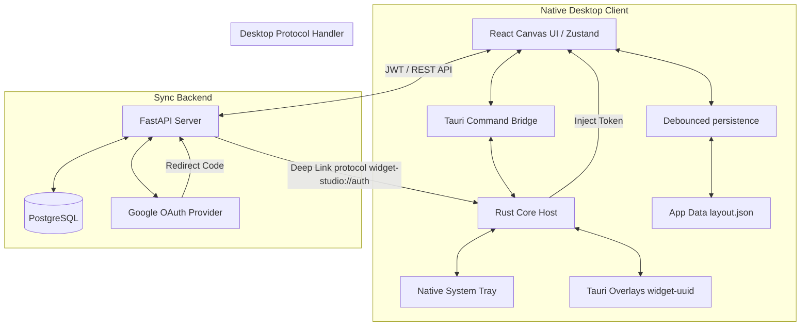
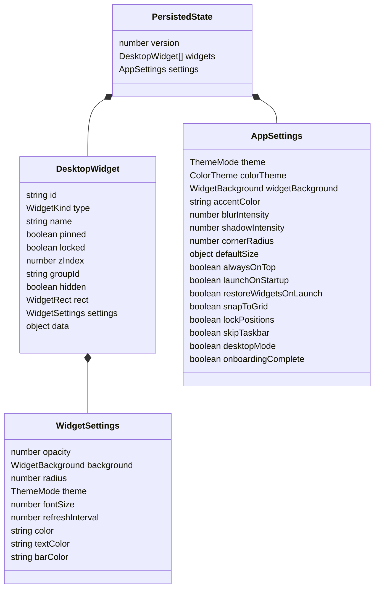
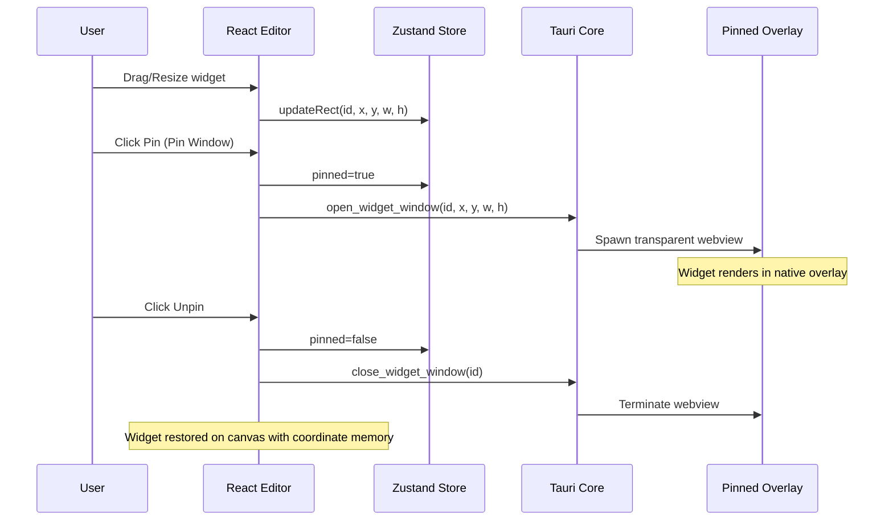

# Desktop Widgets — System Design Specification

Exported: 12 July 2026

## Product Scope

Desktop Widgets is a Windows 11 widget host built with Tauri v2, React, TypeScript, Zustand, Tailwind CSS, and Rust. It provides a visual editor canvas plus independent transparent desktop overlay windows for clocks, weather, calendars, task managers, custom widgets, mindmaps, calculators, and system monitors. The application supports cloud layout synchronization and user authentication with a FastAPI + PostgreSQL backend.

---

## System Architecture

---

## Runtime Surfaces

### Main Editor Window
- **Widget Library**: Add any of the 13 modular widget kinds to the dashboard.
- **Active-Widget List**: Displays active widget instances with status (pinned, locked, visible) and immediate actions (visibility toggling, duplication, deleting).
- **Interactive Canvas**: Drag, drop, and custom-resize widget frames. Layout options include 12px grid snapping, selection rings, and alignment.
- **Inspector Panel**: Configures style, position, sizing, custom color overrides, fonts, and widget-specific settings (e.g. timezone select, custom embed URL, API refresh intervals).
- **Settings Panel**: Adjusts accent colors, global acrylic blur intensity, custom border radius, launch-on-startup, automatic state restoration, taskbar visibility, and layout lock state.

### Desktop Overlay Windows
Each pinned widget spawns an independent, frameless, transparent Tauri webview window identified by `widget-<uuid>`.
- The windows bypass the Windows taskbar (`skip-taskbar`) and stay locked to the desktop.
- A native visibility monitor guards widget positions, restoring widgets when Windows executes "Show Desktop" gestures.
- Clicking "Unpin" safely closes the overlay window and restores the interactive widget back to the React editor canvas with its exact position and size intact.

### System Tray
The native taskbar tray enables commands like `Show widgets`, `Hide widgets`, `Open settings`, and `Quit`. Left-clicking the icon focuses and restores the editor.

---

## State Model

### Widget Kinds (`WidgetKind`)
- `clock`: Analog/digital time widget
- `worldclock`: Multi-timezone tracking
- `weather`: Ambient offline-safe weather conditions
- `notes`: Light text notes
- `stickynotes`: Windows-style post-it grids
- `todo`: Task checklist
- `system`: CPU and memory utility graphs
- `pomodoro`: Focus timer
- `calculator`: Operator math workspace
- `calendar`: Month planning grid
- `links`: Fast shortcut bookmark list
- `mindmap`: Nodes and branching ideas
- `custom`: HTML / Web URL embedder

---

## Widget Lifecycle & Coordinate Memory

- When pinned, layout coordinates are synchronized to Tauri.
- The webview loads the application with a search query parameter `?widget=<id>` to render only the widget's view inside the window.
- Unpinning removes the window and re-renders the widget frame directly on the user's canvas.

---

## Native Implementation Details

### Custom Deep Link Protocol
Tauri registers the `widget-studio://` custom protocol handler.
1. When a user clicks **Login with Google** in the desktop client, the browser navigates to the FastAPI login.
2. The server processes the authorization and redirects to `widget-studio://auth?token=<jwt>&email=<email>`.
3. The native Tauri application intercepts the protocol command, reads the arguments, and injects the session credentials back into the Zustand authentication store.

### Zero Console Popup Strategy
To prevent command windows (PowerShell/CMD) from flickering or popping up during system executions (like autostart registry configuration or helper scripts), all process executions are spawned with appropriate window creation flags on Windows:
- Process creation uses Rust's `std::process::Command` or `tauri-plugin-shell` configured to run detached, passing `CREATE_NO_WINDOW` (flags `0x08000000`) to the underlying Windows process creator.

---

## Build and Delivery

- **Local Preview**: `npm run dev`
- **Native Debugging**: `npm run tauri:dev`
- **Frontend Compiler**: `npm run build`
- **Windows Compilation**: `npm run tauri:build` (compiles `.msi` and `.exe` installation packages)
