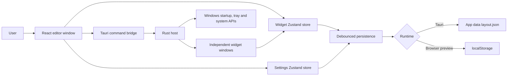
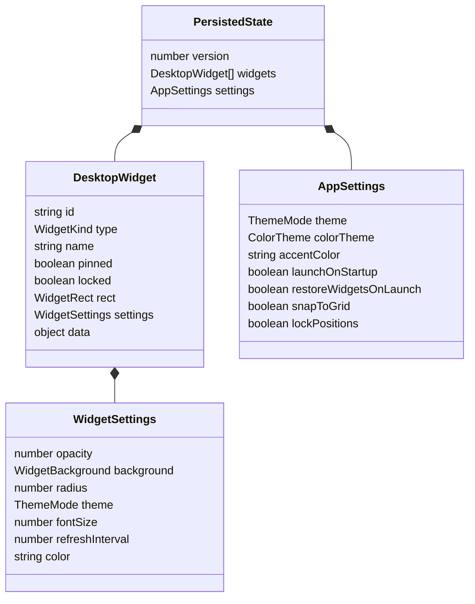
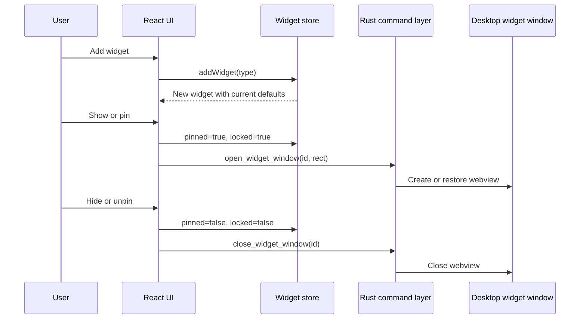

# Desktop Widgets — Current System Design

Exported: 12 July 2026

## Product scope

Desktop Widgets is a Windows 11 widget host built with Tauri 2, React, TypeScript, Zustand, Tailwind CSS, and Rust. It provides a visual editor plus independent transparent desktop windows for clocks, weather, tasks, notes, system monitoring, links, and calendars.

## System architecture

## Runtime surfaces

### Main editor window

- Widget library for creating and opening all seven widget types.
- Active-widget list with select, show, hide, duplicate, and delete controls.
- Canvas with draggable and resizable widget previews.
- Control center for selection, naming, overlay visibility, locking, appearance, exact sizing, duplication, and deletion.
- Inspector for detailed style, position, size, and widget-specific controls.
- Settings panel for app themes, brightness, accent, global widget appearance, startup, layout, and snapping.

### Desktop widget windows

Each pinned widget is a separate frameless Tauri webview window named `widget-<uuid>`. These windows are transparent, skip the taskbar, have no decorations, and cannot be minimized normally. A native visibility monitor restores a widget if Windows minimizes or hides it, including through the three-finger show-desktop gesture.

### System tray

The native tray exposes Show widgets, Hide widgets, Open settings, and Quit. A left click restores and focuses the main editor.

## State model

Widget state lives in `widgetStore`; application preferences live in `settingsStore`. Changes are combined and saved after a 300 ms debounce. Schema version 2 enables startup once for existing installations while retaining the user's ability to disable it later.

## Widget lifecycle

## Visual design system

The UI uses CSS custom properties as design tokens: surface, panel, text, muted, accent, secondary accent, tertiary accent, shadow strength, and canvas colors. Light and dark brightness modes are independent from the selected color theme.

Available themes:

- Berry Pop
- Citrus Splash
- Ocean Candy
- Lavender Dream
- Mint Sorbet
- Midnight Neon

Widgets support automatic coloring or an individual custom tint. Tinting works with glass and solid backgrounds. Theme-aware scrollbars use the active primary and secondary accents.

## Native responsibilities

Rust commands own layout file I/O, startup registration, system information, editor-window visibility, window flags, widget-window creation and removal, sizing, and positioning. The React layer never accesses the Windows APIs directly.

The layout is stored under the Tauri app-data directory as `layout.json`. Browser-only development falls back to `localStorage` using the key `desktop-widgets-state`.

## Control responsibility

| Action | Store effect | Native effect |
|---|---|---|
| Add | Creates widget | None |
| Show/pin | Sets pinned and locked | Creates/restores widget window |
| Hide/unpin | Clears pinned and locked | Closes widget window |
| Lock | Sets locked | None |
| Duplicate | Copies widget and offsets position | None |
| Delete | Removes widget | Closes widget window |
| Move/resize | Updates rectangle | Overlay window synchronizes position/size |
| Startup toggle | Updates settings | Enables/disables Windows auto-start |

## Build and delivery

- Development UI: `npm run dev`
- Native development: `npm run tauri:dev`
- Type validation: `npm run lint`
- Frontend build: `npm run build`
- Windows packaging: `npm run tauri:build`
- Bundle targets: MSI and NSIS

## Known extension points

- Weather currently uses an offline placeholder and needs a provider integration.
- Battery information currently returns `null` pending a Windows-specific implementation.
- Todo, Notes, and Quick Links can be extended with richer item-management controls.
- Automated UI tests are not yet included; current validation is TypeScript, Vite, and Cargo based.
